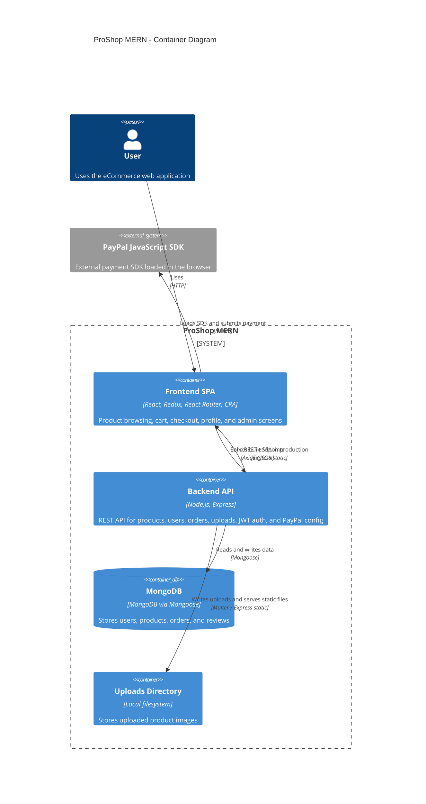

# Architecture

## C4 Container

## Description

The frontend is a Create React App single-page application. Routing is handled in `frontend/src/App.js`, application state is managed through Redux in `frontend/src/store.js`, and API access goes through Redux actions using Axios.

The backend starts in `backend/server.js`. It exposes REST routes under `/api/products`, `/api/users`, `/api/orders`, and `/api/upload`; route handlers delegate to controllers and Mongoose models. Protected routes use JWT verification from `backend/middleware/authMiddleware.js`.

MongoDB is accessed through Mongoose using `MONGO_URI` in `backend/config/db.js`. Uploaded product images are written to the local `uploads/` directory and served from `/uploads`.

PayPal integration is implemented in the browser: `OrderScreen.js` requests `/api/config/paypal` for the client id, loads `https://www.paypal.com/sdk/js`, and sends the payment result back to the backend order API.
