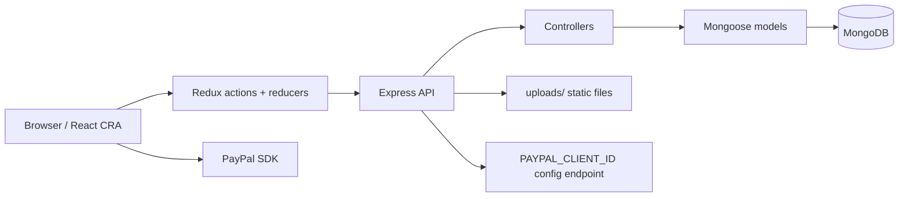

# Architecture — proshop_mern

ProShop MERN is a training eCommerce app with a Create React App frontend, a Node.js/Express API, MongoDB persistence through Mongoose, JWT authentication, file uploads, and PayPal sandbox checkout.

## Runtime Flow

## Entry Points

- Backend: `backend/server.js`
- Frontend: `frontend/src/index.js`
- React routes: `frontend/src/App.js`
- Redux store: `frontend/src/store.js`
- Database connection: `backend/config/db.js`

## Backend Shape

- `backend/routes/*` defines HTTP routes and middleware chains.
- `backend/controllers/*` contains request handling and business logic.
- `backend/models/*` defines Mongoose schemas for users, products, and orders.
- `backend/middleware/authMiddleware.js` verifies JWT tokens and admin access.
- `backend/routes/uploadRoutes.js` handles product image upload paths.

## External Services

- MongoDB via `MONGO_URI`.
- PayPal sandbox/client SDK via `PAYPAL_CLIENT_ID`.
- JWT signing via `JWT_SECRET`.

## Local Runtime

The backend normally runs on `PORT=5005` in this fork, and the frontend CRA dev server runs on `3000` with a proxy to `http://127.0.0.1:5005`.
